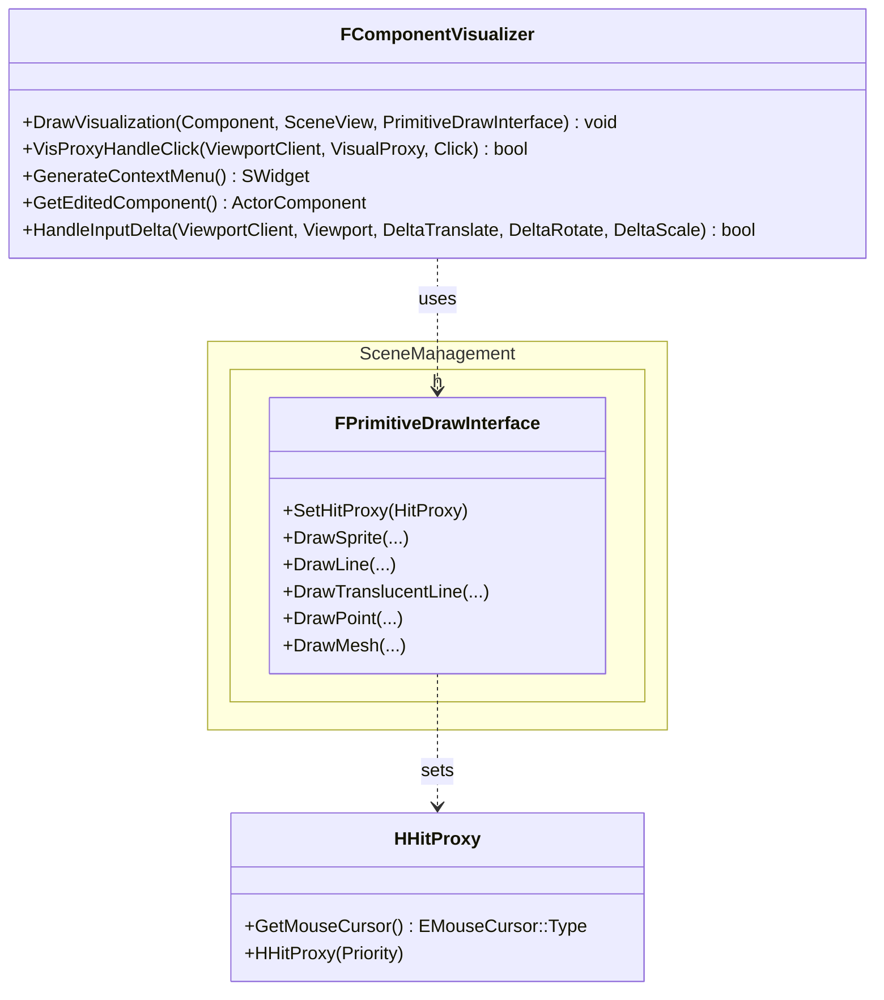

Component visualizers (base class `FComponentVisualizer`) are classes defining editor utilities and drawing for a given actor component class. Component visualizers commonly perform following tasks:
- custom drawing (for example, splines in UE are drawn with the `FSplineComponentVisualizer`)
- menus and HUD (handling right clicks etc.)
- binding UI commands to actual component methods (deleting or adding spline points)
- handling user transform inputs (moving, scaling, rotating)

## Intro

Unreal Engine allows for custom drawing per actor component using `FComponentVisualizer`. `FComponentVisualizer` instance should be a singleton and is registered with `UUnrealEdEngine::RegisterComponentVisualizer`. For example, in `ComponentVisualizers` native module:

```cpp
void FComponentVisualizersModule::RegisterComponentVisualizer(FName ComponentClassName, TSharedPtr<FComponentVisualizer> Visualizer)
{
    if (GUnrealEd != NULL)
    {
        GUnrealEd->RegisterComponentVisualizer(ComponentClassName, Visualizer);
    }

    RegisteredComponentClassNames.Add(ComponentClassName);

    if (Visualizer.IsValid())
    {
        Visualizer->OnRegister();
    }
}

void FComponentVisualizersModule::StartupModule()
{
	RegisterComponentVisualizer(UPointLightComponent::StaticClass()->GetFName(), MakeShareable(new FPointLightComponentVisualizer));
	// ... and other modules
}
```

Note that, because `FComponentVisualizer` is a singleton (it is not created per actor component instance and is not bound to it), you will have to implement logic to keep track of actor components that are currently selected/edited by the user to implement custom drawing for such components (highlight components that are selected/edited). For example, `FSplineComponentVisualizer` defines a `USplineComponentVisualizerSelectionState`. The latter caches the spline component, the ultimate owning actor (if the spline comopnent is contained within an actor within a `ChildActorComponent`), etc. The `USplineComponentVisualizerSelectionState` singleton is created, owned and updated (on hit proxy clicks, see below) by the `FSplineComponentVisualizer` singleton.

## Classes



| Method | Reference |
| --- | --- |
| FComponentVisualizer::DrawVisualization | contains the actual drawing code, is called on editor viewport render pass | 
| FComponentVisualizer::VisProxyHandleClick | handles click on the hit proxy. Hit proxies are created by PrimitiveDrawInterface (see below) |
| FPrimitiveDrawInterface::SetHitProxy | sets current hit proxy (stateful). After this call: `SetHitProxy(MyHitProxy)`, all elements drawn with subsequent `Draw...` calls will be hit-testable and bound to `MyHitProxy. To stop this, clear it: `SetHitProxy(NULL)` |
| HHitProxy::GetMouseCursor | define cursor type when this hit proxy registers user click, and define priority in constructor. You should normally create implementations of this class which store relevant info (for example, index of control point or segment of a spline in case of `USplineComponent`) |
| SceneManagement.h | defines a number of drawing helper functions including spheres, boxes, arrows, etc. |
| FComponentVisualizer::GenerateContextMenu | provides the `SWidget` widget that should show up when the user right-clicks on the component |
| FComponentVisualizer::GetEditedComponent | override to return the component that is currently edited (handle this via the user clicks on hit proxies) |
| FComponentVisualizer::HandleInputDelta | handles transforms performed by the user. Transforms can be, for example, applied to selected spline points. For this, the selected elements must be cached and updated by the `FComponentVisualizer` itself (see explanation elsewhere on this page) |
