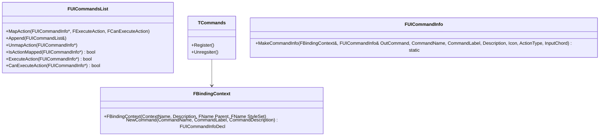

import WIP from '/src/components/WIP.astro';
import Pannable from '/src/components/Pannable.astro';

This section describes how to build custom editor menus.

## Menu builders and commands

<WIP/>

<Pannable initialZoom={3}>

</Pannable>

