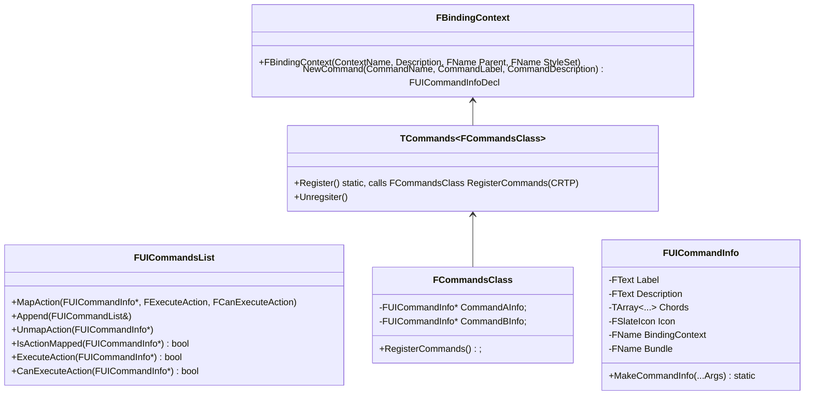

import WIP from '/src/components/WIP.astro';
import Pannable from '/src/components/Pannable.astro';

This section describes how to build custom editor menus.

## Menu builders and commands

<WIP/>

<Pannable initialZoom={3}>

</Pannable>

- `FUICommandInfo` contains meta about the command such as its name and description, what key combinations (chords) are valid for it etc. `FUICommandInfo` can be created with its static method `MakeCommandInfo` or with the `UI_COMMAND` macro
- `TCommands<FCommandsClass>` is a manager for FCommandsClass, it will create and keep a singleton of `FCommandsClass`
- an `FCommandsClass` is usually just a singleton container (managed by `TCommand` via CRTP) having the `FUICommandInfo*` command infos, they are populated in `RegisterCommands()` either with `FUICommandInfo::MakeCommandInfo()` or with the `UI_COMMAND` macro

