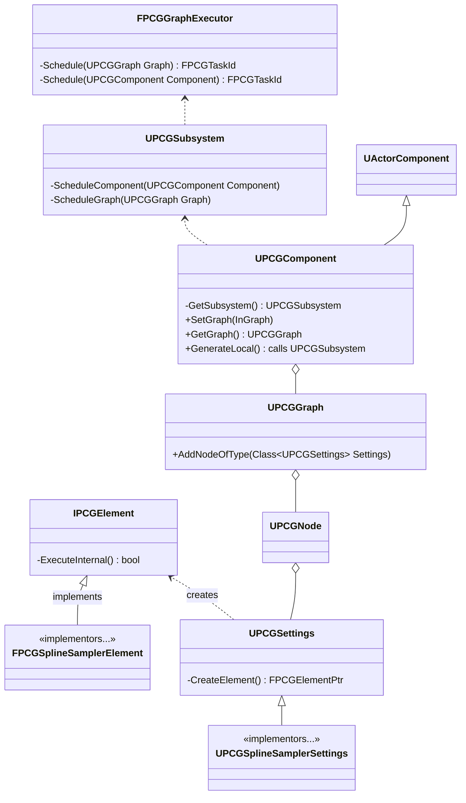
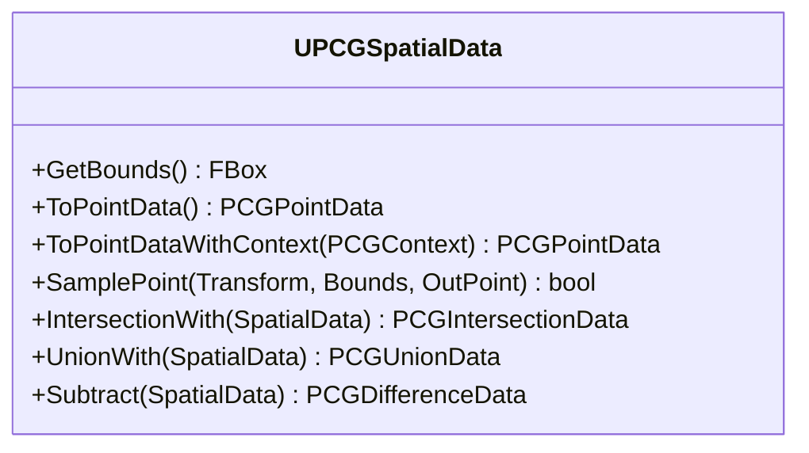
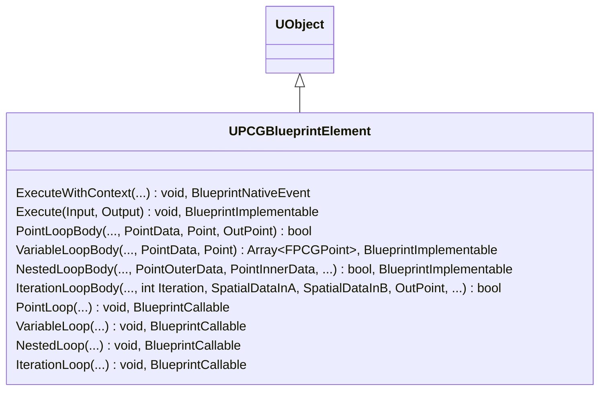

import { Steps } from '@astrojs/starlight/components';

## General architecture overview

Note: in the below UML, public methods mean Blueprint-visible methods, and private methods mean C++-only methods (public, protected, or private)

- FPCGGraphExecutor is the class actually responsible for executing the graph. Execution is scheduled and returns execution tasks
- [UPCGSubsystem](https://dev.epicgames.com/documentation/en-us/unreal-engine/API/Plugins/PCG/UPCGSubsystem) is the subsystem that has access to FPCGGraphExecutor and manages graphs and graph execution, among other things
- [UPCGGraph](https://dev.epicgames.com/documentation/en-us/unreal-engine/API/Plugins/PCG/UPCGGraph) holds the instructions on the procedural generation. Think of it as an asset. UPCGGraph does not do generation or even data sampling, it's just a data asset
- [UPCGNode](https://dev.epicgames.com/documentation/en-us/unreal-engine/API/Plugins/PCG/UPCGNode) is the node interface. Think of it as a visual shell having inputs, outputs, etc.
- [UPCGSettings](https://dev.epicgames.com/documentation/en-us/unreal-engine/API/Plugins/PCG/UPCGSettings) is what actually defines the node. UPCGSettings is saveable to asset manager, and it holds parameters for a given PCG operation. For example, the UPCGSplineSamplerSettings implementor contains settings for spline sampling. UPCGSettings is also responsible for creating the actual graph execution unit which is IPCGElement. Its implementors, like FPCGSplineSamplerElement, define the actual graph node execution logic in their overriden `ExecuteInternal` method
- [UPCGComponent](https://dev.epicgames.com/documentation/en-us/unreal-engine/API/Plugins/PCG/UPCGComponent) is a component that points to a UPCGGraph and does graph execution, though not by itself but calling UPCGSubsystem instead. It is also responsible for providing certain spatial data on the owning actor

## PCG flow

In general, PCG graph follow this pattern:

<Steps>
1. *Obtain spatial input data*

    The data usually comes from the actor owning the PCG component. It can be volume, mesh, splines, landscape, etc.

2. *Sample points on this data*

    There is a number of samplers available. Points can be sampled on a spline, in a volume, on a landscape, uniformly or randomly

3. *Points operations/transformations*

    PCG provides a large number of operations to affect the points distribution

4. *Create instances or actors on the points*

    The points may be used to create static meshes, foliage, or actors. The actors placed will inherit points transforms

</Steps>

## PCG data flows

### PCG graph parameters

PCG graphs can accept parameters. The collection of parameters for a PCG graph is represented as `FInstancedPropertyBag` which is basically a `Map<Fname,ArbitraryType>` with some quality-of-life features on top. This property bag can store parameters with any value type and allows to set and get them by their name. In blueprints, one can set and get parameters by their name for the `UPCGGraphInstance` of this blueprint actor's `UPCGComponent`. Graph parameters do not support array or maps of values. Also, one cannot perform operations like member access, iteration, and similar, on the parameter values inside the `PCGGraph`. Instead, they are usually set as attributes of the spatial data. The attributes can later be used by static mesh spawners or similar nodes.

### Spatial data

Implementations of UPCGSpatialData include:

- UPCGPointData
- UPCGVolumeData
- UPCGDifferenceData, UPCGUnionData, UPCGIntersectionData
- UPCGWorldRayHitData
- UPCGLandscapeData
- UPCGSplineData
- UPCGSurfaceData

... and others

## Graph Editor

### Shortcuts

| Shortcut | Action |
| --- | --- |
| A | Toggle inspection for a node |
| E | Toggle enabled/disabled for one or more nodes |
| D | Toggle debugging for one or more nodes |

### Inspector

Inspector allows inspecting properties and attributes per data bit in a tabular view (the area at the bottom of the editor). Since there can be multiple actors utilizing the same PCG graph in a given level, the editor allows you to switch between the actors to inspect in the list view to the left of the inspector. Only one graph node can be inspected at a time. You can inspect inputs and outputs of the node (switch between input/output inspection in the inspector's menu).

## FAQ

### What is the difference between properties and attributes?

Properties are built-in data fields - for example, position of a point. Attributes are user-defined metadata items - for example, density of a point. Attributes can be created and attached to the spatial data inside the graph. In selectors, properties are referenced by prefixing the name with `$` while attributes are referenced by prefixing their name with `@`.

### Who owns spawned elements?

The static meshes spawned by PCG are packed into ISM/HISM components attached to the actor that owns the generating PCG component, or the partition helper actor, if partition is used. The components are marked with special tags ("PCG generated component"). The actors spawned by PCG are spawned into level as children of the actor that owns the generating PCG component, or the partition helper actor, if partition is used. The created components or actors are persisted to disc. One can detach the generated components and actors from their original owner, and in this case they are simply placed into level as children of a dummy actor, and no longer react to graph updates etc.

### When in the editor-game cycle does procedural generation happen?

The procedural generation normally happens when the PCG graph is updated, if regen is not paused. Also, generation might happen when the PCG component loads. This is governed by `Generation tigger` property of the PCG component - it can be set to 'Generation on load' or 'Generation on demand'. 

### Spawning on landscape VS static meshes

[TBD] Usually sample static meshes separately with ray-hits, then combine the point streams with the points sampled from landscape.

### Are points of different PCG components aware of each other?

No. If two PCG components overlap and point to the same graph, the graph points will be generated at a duplicate rate in the area of overlap. The graph must take care of conflict resolution and point-deduplication (by differencing on the spatial data of conflicting actors).

### PCG vs landscape foliage (hand-painted and material-generated)

### Bounds modifier VS Extents modifier?

The bounds modifier allows scaling the points non-uniformly - meaning, scaling the box by different values in left, right, forward, backward, up, and down directions from the pivot. Extents modifier sets bounding box extents preserving symmetry around the pivot. The bounds modifier can be used to match static mesh shape much more closely than the extents modifier.

## Selected nodes reference

This section contains additional comments on some of the nodes. Epic Games documentation may be found [here](https://dev.epicgames.com/documentation/unreal-engine/procedural-content-generation-framework-node-reference-in-unreal-engine).

### Execute Blueprint

Executes a blueprint instance of a blueprint inheriting from `UPCGBlueprintElement`. The `UPCGBlueprintElement` is a `Blueprintable` that allows to override, for example, `PointLoopBody`. This allows to perform custom operations on PCG point data.

## Misc

### Point density

Each point is assigned a random `density` attribute when points are generated. The density can be used to spawn different meshes depending on it or conditionally deactivate spawning. The density can also be manipulated and/or set from the graph - for example, with the `Normal to Density` node, which produces a density value depending on the surface normal, or `Density noise` which randomizes density accross points. Nodes that make use of density are, for example, `Density filter` which filters the points whose density falls within a specific range.

### Named reroutes

Named reroutes basically allow to save the output pin of a node sub-tree into a named variable that can be used everywhere else in the graph. They are essential to keep large graphs well-organized.

## Insights

### Set operations do not only work for points

Set operations (difference, union, etc.) can also be performed on other types of spatial data - for example, collision shapes of actors. This makes it especially convenient to remove points that collide with collision shapes of actors in the world - for example, preventing spawning trees inside buildings etc.

### Applying procedural generation to existing world actors

You can easily apply procedural generation to certain existing world actors. They can be accessed by the `GetActorData` node and they can be limited to a certain class and only to actors that are overlapping the PCG volume. In this way, you can scatter things around actors or spawn elements onto existing level meshes.