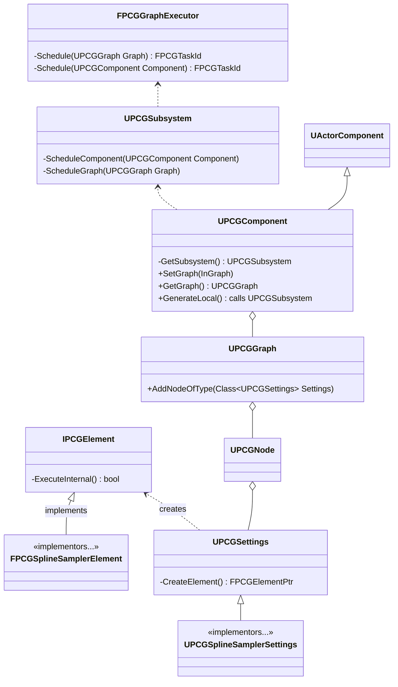
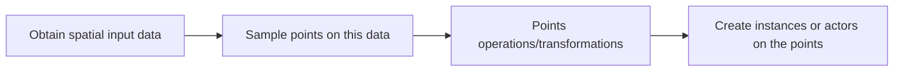

import { Steps } from '@astrojs/starlight/components';

## General architecture overview

Note: in the below UML, public methods mean Blueprint-visible methods, and private methods mean C++-only methods (public, protected, or private)

- FPCGGraphExecutor is the class actually responsible for executing the graph. Execution is scheduled and returns execution tasks
- [UPCGSubsystem](https://dev.epicgames.com/documentation/en-us/unreal-engine/API/Plugins/PCG/UPCGSubsystem) is the subsystem that has access to FPCGGraphExecutor and manages graphs and graph execution, among other things
- [UPCGGraph](https://dev.epicgames.com/documentation/en-us/unreal-engine/API/Plugins/PCG/UPCGGraph) holds the instructions on the procedural generation. Think of it as an asset. UPCGGraph does not do generation or even data sampling, it's just a data asset
- [UPCGNode](https://dev.epicgames.com/documentation/en-us/unreal-engine/API/Plugins/PCG/UPCGNode) is the node interface. Think of it as a visual shell having inputs, outputs, etc.
- [UPCGSettings](https://dev.epicgames.com/documentation/en-us/unreal-engine/API/Plugins/PCG/UPCGSettings) is what actually defines the node. UPCGSettings is saveable to asset manager, and it holds parameters for a given PCG operation. For example, the UPCGSplineSamplerSettings implementor contains settings for spline sampling. UPCGSettings is also responsible for creating the actual graph execution unit which is IPCGElement. Its implementors, like FPCGSplineSamplerElement, define the actual graph node execution logic in their overriden `ExecuteInternal` method
- [UPCGComponent](https://dev.epicgames.com/documentation/en-us/unreal-engine/API/Plugins/PCG/UPCGComponent) is a component that points to a UPCGGraph and does graph execution, though not by itself but calling UPCGSubsystem instead. It is also responsible for providing certain spatial data on the owning actor

## PCG flow

In general, PCG graph follow this pattern:

<Steps>
1. *Obtain spatial input data*

    The data usually comes from the actor owning the PCG component. It can be volume, mesh, splines, landscape, etc.

2. *Sample points on this data*

    There is a number of samplers available. Points can be sampled on a spline, in a volume, on a landscape, uniformly or randomly

3. *Points operations/transformations*

    PCG provides a large number of operations to affect the points distribution

4. *Create instances or actors on the points*

    The points may be used to create static meshes, foliage, or actors. The actors placed will inherit points transforms

</Steps>